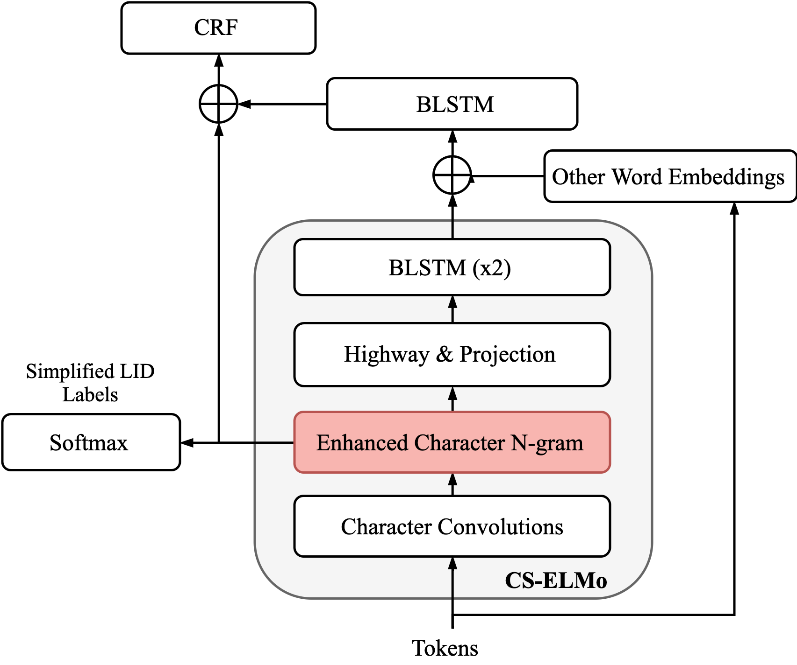
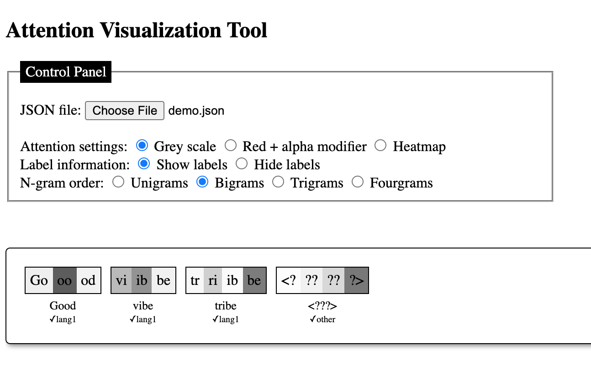

# From English to Code-Switching: Transfer Learning with Strong Morphological Clues (ACL 2020)
<p align="right"><i>Authors: Gustavo Aguilar and Thamar Solorio</i></p> 

[](https://opensource.org/licenses/MIT) 

This repository contains the implementations of the **CS-ELMo** model introduced in the paper 
["From English to Code-Switching: Transfer Learning with Strong Morphological Clues"](https://www.aclweb.org/anthology/2020.acl-main.716.pdf) at ACL 2020.

<div></div>

The main contribution of this model is the **enhanced character n-gram module** 
(the highlighted component from the image). 
Please refer to the [paper](https://www.aclweb.org/anthology/2020.acl-main.716.pdf) for details.


## Installation

We have updated the code to work with Python 3.8, PyTorch 1.6, CUDA 10.2.
If you use conda, you can set up the environment as follows:

```bash
conda create -n cselmo python=3.8
conda activate cselmo
conda install pytorch==1.6 cudatoolkit=10.2 -c pytorch
```

Also, install the dependencies specified in the requirements.txt:
```
pip install -r requirements.txt
```

## Data

This repo contains dataset files that serve as templates for the sake of the example. 
Please replace the files with your data. 
You can either add a new directory in `CS_ELMo/data/your_dataset_dir` or replace the content of one of the existing dataset directories.
Make sure you provide the correct paths to the data split in the config file. 
For example, `CS_ELMo/configs/lid.spaeng.exp3.3.json` contains this:

```json
    ...
    "dataset": {
        "train": "lid_calcs16_spaeng/train.txt",
        "dev": "lid_calcs16_spaeng/dev.txt",
        "test": "lid_calcs16_spaeng/test.txt"
    },
```

## Running

There are two main stages to run this project.
1. Code-switching adaptation with LID
2. Code-switching downstream fine-tuning

> We use config files to specify the details for every experiment (e.g., hyper-parameters, datasets, etc.). You can use or modify any config file from the `CS_ELMo/configs` directory.

### 1. Code-switching adaptation with LID

We use multi-task learning (MTL) with the full and simplified LID label schemes. 
To train this model in the MTL setting, make sure the config file contains the `"use_second_task"` field:

```
"model": {
    ...
    "charngrams": {
        "use_second_task": true,
        ...
    }
}
```

You can train a model from pre-defined config files from this repo like this (Exp3.3 from the paper):

```bash
python src/main.py --config configs/lid.spaeng.exp3.3.json --gpu 0
```

> The `gpu` argument specifies the GPU label and is optional. If `gpu` is not provided, the code runs on CPU.

The code saves a model checkpoint after every epoch if the model improves (either lower loss or higher metric). 
You will notice that a directory is created using the experiment id (e.g., `CS_ELMo/checkpoints/lid.spaeng.exp3.3/`). 
You can resume training by running the same command.

To evaluate the model, use `--mode eval` (default: `train`):

```bash
python src/main.py --config configs/lid.spaeng.exp3.3.json --gpu 0 --mode eval
```

### 2. Code-switching downstream fine-tuning

Now you can load the CS-adapted model (a.k.a CS-ELMo) and fine-tune it to downstream tasks like NER or POS tagging. 
Here's an example for NER (Exp 5.2 from the paper):

```bash
python src/main.py --config configs/ner.spaeng.exp5.2.json --gpu 0
```

The config contains the following fields to do the fine-tuning:

```
    ...
    "pretrained_config": {
        "path": "configs/lid.spaeng.exp3.3.json",
        "pretrained_part": "elmo",
        "finetuning_mode": "frozen_elmo"
    }
```

the fine-tuning mode can be any option from `['fully_trainable', 'frozen_elmo', 'inference']`, and the pre-trained part can be either just the CS-ELMo architecture (i.e., `"elmo"`) or using possible weights that resemble the new model such as BLSTM, word embeddings, and the simplified LID inference layer (i.e., `"full"`).


### Visualizations

We have added a Javascript/HTML script to visualize the attention weights in the hierarchical model. 
The tool is located at `CS_ELMO/visualization/attention.html`, and you will need to load a JSON file containing the attention weights.
This JSON file is automatically generated after evaluating a model. 
Here's an example of how the tool works:

<div></div>


## Citation

```text
@inproceedings{aguilar-solorio-2020-english,
    title = "From {E}nglish to Code-Switching: Transfer Learning with Strong Morphological Clues",
    author = "Aguilar, Gustavo  and Solorio, Thamar",
    booktitle = "Proceedings of the 58th Annual Meeting of the Association for Computational Linguistics",
    month = jul,
    year = "2020",
    address = "Online",
    publisher = "Association for Computational Linguistics",
    url = "https://www.aclweb.org/anthology/2020.acl-main.716",
    doi = "10.18653/v1/2020.acl-main.716",
    pages = "8033--8044"
}
```

## Contact

Feel free to get in touch via email to gaguilaralas@uh.edu.

